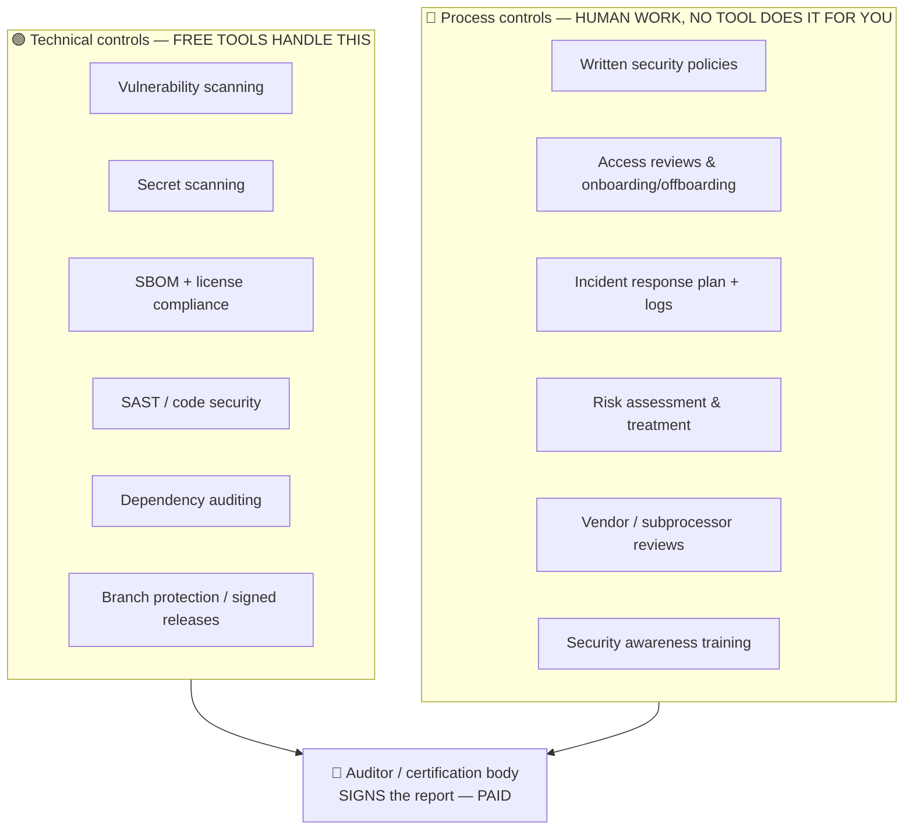

# 📜 SOC 2 / ISO 27001 — The Honest Guide (and the free toolkit)

> You asked for tools that let you "write code from a more professional and legally
> accepted standard… SOC, SOC II, ISO." Here's the truth, plus the free things that
> genuinely move you toward it. This page exists so you don't waste money or get a
> false sense of security.

---

## ⚠️ The truth nobody tells solo devs first

> **SOC 2 and ISO 27001 are not things you install. They are audits of how your
> *organization behaves over time* — and they are signed by a human auditor, not a tool.**

- **SOC 2** is an attestation written by a **licensed CPA firm** after examining your
  controls. A *Type II* report covers a window (typically 6–12 months) of evidence
  that you *actually followed* your own policies. Audit fees are usually **$10k–$50k**,
  separate from any software.
- **ISO 27001** is a certification from an **accredited certification body** after a
  two-stage audit of your **ISMS** (Information Security Management System) —
  documented risk assessments, a risk treatment plan, policies, and proof you operate
  them.

**No scanner produces the attestation.** What free tools *can* do is handle the
**technical controls** tier and generate machine evidence. The **process controls**
tier (policies, access reviews, incident logs, vendor assessments, training) is human
work that must exist *before* the audit window — and that's exactly where first-timers
fail.

So the realistic stance for you, today:

> **Build "audit-ready" engineering habits now (free), so that *if* you ever decide to
> get certified, the technical half is already done and you're only paying for the
> auditor + writing the policies.** Don't buy a $10k/yr GRC platform until a paying
> customer is contractually requiring SOC 2.

---

## The two tiers

---

## ✅ The FREE technical-controls toolkit (all in the cart)

These are stocked in the [catalog](../catalog/catalog.md) under **Security** and
**Compliance**. Together they cover the machine-evidence half for free:

| Need | Free tool | What it gives an auditor |
|------|-----------|--------------------------|
| Software Bill of Materials | **Syft** (SPDX/CycloneDX) | "Here's every component we ship." |
| Dependency vulnerabilities | **Grype**, **OSV-Scanner**, **pip-audit** | "We scan for CVEs continuously." |
| Static code security (SAST) | **Semgrep CE**, **Bandit** (Py), **eslint-plugin-security** (JS) | "We catch insecure patterns pre-merge." |
| Secret scanning | **Betterleaks** / gitleaks, **TruffleHog** | "No credentials in our code or history." |
| License compliance | **FOSSA CLI** (free tier) | "No license conflicts in our deps." |
| Repo security posture | **OpenSSF Scorecard** | "Here's our hygiene score (branch protection, pinned deps, signed releases)." |
| Recognized self-attestation | **OpenSSF Best Practices Badge** | A public badge mapping to control areas, recognized by enterprise buyers. |

> Wire these into a **pre-commit** config + a **CI** job and you have *continuous,
> timestamped evidence* — which is exactly what a Type II audit wants. A ready
> `.pre-commit-config.yaml` is in [`starter-kit/`](../starter-kit/).

---

## 🔴 The process half (free templates + discipline, no purchase)

You can do all of this for $0 with markdown files in a private repo:

1. **Policies** — write short, real policies (Access Control, Change Management,
   Incident Response, Data Retention, Vendor Management). Ask Claude to draft them
   from free OSS templates, then make them *true* for how you actually work.
2. **Risk register** — a simple table: asset → threat → likelihood → impact →
   mitigation. Keep it in the repo or your Obsidian vault.
3. **Change management** — you already have it: PRs + reviews + CI. Document that
   *as* your change-management control.
4. **Access reviews** — quarterly: list who/what has access to what, confirm it's
   still needed. Log the date.
5. **Incident log** — even "no incidents this quarter" entries count as evidence the
   process exists.

> 💡 Use the prompt-forge skill (`starter-kit/skills/prompt-forge`) to have Claude
> draft a starter policy pack, then you edit for accuracy. **Never claim a control you
> don't actually do** — that's the one unforgivable audit sin.

---

## 🪟 The paid platforms (Showroom only — do NOT buy yet)

**Vanta, Drata, Secureframe** automate evidence collection and auditor-ready
reporting. They're good — and **$5k–$25k+/year**, plus the auditor fee on top. Per the
[Protocol](./PROTOCOL.md) Gate G1, they're **SHOWROOM** (logged, not bought).

**Buy one only when:** a paying customer's contract *requires* a SOC 2 report, i.e.
the spend is directly unblocking revenue. Until then, the free toolkit + disciplined
markdown policies put you in a strong position at zero cost.

---

## Your "audit-ready from day one" checklist (free)

Pin this; it doubles as good engineering hygiene even if you never get certified:

- [ ] Branch protection on `main` (PRs + review required)
- [ ] CI runs on every PR (tests + the security scanners above)
- [ ] `pre-commit` blocks secrets + lints before commit
- [ ] SBOM generated on release (Syft) and scanned (Grype)
- [ ] Dependencies audited (OSV-Scanner / pip-audit) on a schedule
- [ ] OpenSSF Scorecard run; fix the easy wins
- [ ] A `/security` policy folder exists with real, followed policies
- [ ] A risk register + incident log exist (even if short)
- [ ] Secrets live in a manager / env, never in git
- [ ] OpenSSF Best Practices Badge: Passing

> Tick these and you've done the free 80%. The remaining 20% is a cheque to an
> auditor and a few weeks of policy writing — only worth it when revenue depends on it.
