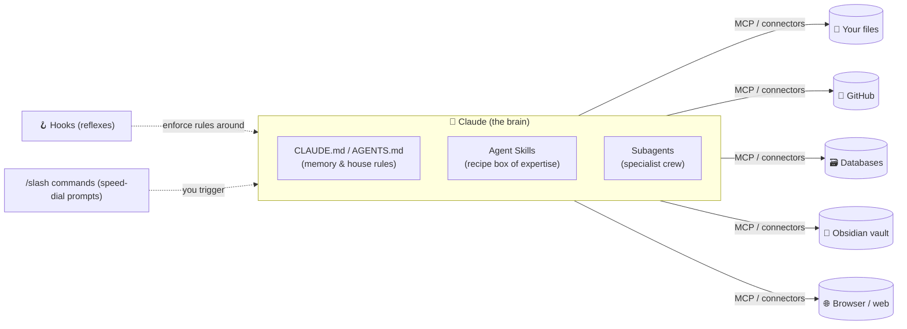

# 📖 Plain-English Glossary — "What even *is* an MCP?"

> You said you've never used a connector, don't know what an MCP is, and haven't
> touched skills. This page fixes that. No jargon without a translation. Read it
> once and the whole shopping center makes sense.

The mental model to hold in your head:

> **Claude is the brain. Everything below is how you give the brain *hands, memory,
> reflexes, and standard operating procedures*.**

---

## The big six concepts (in order of "learn this first")

### 1. 🔌 MCP — Model Context Protocol
**One line:** A universal plug standard that lets Claude talk to outside tools and
data (your files, GitHub, a database, your Obsidian vault, a browser) through one
consistent "port."

**The analogy:** MCP is **USB-C for AI**. Before USB-C, every device had its own
weird cable. MCP is the standard cable: build a tool once as an "MCP server," and
*any* MCP-aware app (Claude Code, Claude Desktop, Claude.ai, even other AI apps)
can plug into it.

- An **MCP server** is a small program that *exposes* abilities ("read this folder,"
  "query this DB," "search the web," "control a browser").
- Claude is the **client/host** that *calls* those abilities when it decides it needs
  them.
- Servers run either **locally** on your PC (most common — your files never leave
  your machine) or **remotely** over the internet (a hosted URL).

**Why you care:** This is THE thing you were missing. It's how Claude stops being a
chat box and starts actually *doing things in your real environment*.

---

### 2. 🧩 Connector
**One line:** A connector is just an MCP server with the technical setup hidden —
a click-to-enable integration inside Claude.ai / Claude Desktop (Google Drive,
GitHub, Gmail, Notion, Canva...).

**The analogy:** If MCP is USB-C, a **connector is a pre-made, plug-and-play
appliance** — you don't wire anything, you flip a switch.

- Same underlying technology (MCP). Different *packaging*: connectors are the
  beginner-friendly, no-config front door.
- In **Claude Code** you usually add MCP servers via a command or a `.mcp.json`
  file. In **Claude.ai / Desktop** you usually toggle **connectors** in settings.

**Why you care:** You almost certainly *already have several connected* (this very
session has Google Drive, Gmail, Calendar, GitHub, Canva, Figma available). You've
been near them the whole time without realizing it.

---

### 3. 🎓 Agent Skill (the `SKILL.md` system)
**One line:** A reusable folder of *expertise* — a `SKILL.md` file (instructions +
know-how) plus optional scripts/templates — that Claude loads **only when relevant**.

**The analogy:** A skill is a **recipe card in a recipe box**. Claude doesn't read
every card all the time (that would overflow its memory). It reads the title of each
card ("Make a PDF," "Fill an Excel sheet," "Run our deploy checklist"), and only
pulls out the full card when the current task needs it. This is called *progressive
disclosure* — load knowledge on demand.

**Anatomy of a skill:**
```
my-skill/
  SKILL.md          ← markdown with a YAML header (name + description) and instructions
  scripts/          ← optional helper scripts Claude can run
  templates/        ← optional files/boilerplate
```
The YAML header looks like:
```yaml
---
name: Brand Poster Brief
description: Use when the user wants a marketing poster. Produces a structured creative brief and a generation prompt.
---
```
Claude reads that `description` to decide *when* to use the skill.

**Where it works:** Claude Code, the Claude desktop/web apps, and the API/Agent SDK.
Same `SKILL.md` format everywhere — write once, use across all of Claude. (Anthropic
ships official skills for PDF/Word/PowerPoint/Excel, for example.)

**Skill vs. slash command:** A **skill** is chosen *by Claude automatically* when the
task matches. A **slash command** (below) is chosen *by you* by typing `/name`.

**Why you care:** This is how you encode *your* standards once — "how I want docs
written," "my poster brief format," "my code-review checklist" — and have every
Claude surface follow them without re-explaining.

---

### 4. 📦 Claude Code Plugin (& marketplaces)
**One line:** A bundle that can ship slash commands + subagents + hooks + MCP servers
together, installable in one step from a "marketplace."

**The analogy:** A plugin is a **boxed combo meal**. Instead of installing four things
separately, someone packaged a coherent set and you grab the whole box.

- A **marketplace** is just a list (a git repo) of plugins you can browse/install.
- Good for distributing a workflow; be a little cautious about *third-party* ones
  (Gate G3 — you're installing someone else's commands/hooks/servers at once).

**Why you care:** Lets you adopt a whole curated workflow in one command. We'll keep
it to trusted/official ones per the Protocol.

---

### 5. 🤖 Subagent
**One line:** A specialized helper Claude Code can spawn that has *its own* context
window, tools, and instructions — to go do a focused sub-task and report back.

**The analogy:** Claude is the **general contractor**; subagents are the **specialist
crew** (the electrician, the plumber). The contractor delegates "go inspect the wiring"
and gets back a summary, without cluttering its own head with every detail.

- Defined as small markdown files in `.claude/agents/`.
- Great for: a `code-reviewer`, a `researcher`, a `test-writer`, a `security-auditor`.
- This is the literal mechanism I used to research *this* shopping center — I fanned
  out parallel research subagents.

**Why you care:** This is "callers to call other tools to do other things" you
mentioned. It's how one Claude session orchestrates many.

---

### 6. 🪝 Hook
**One line:** A command the system runs *automatically* on an event (before/after a
tool runs, when a session starts, when Claude stops) — deterministic reflexes, not
AI guesses.

**The analogy:** Hooks are **reflexes / house rules**. "Whenever a file is saved,
auto-format it." "Before editing, block any change to `.env`." "When a session starts,
run the test suite." It happens every time, guaranteed, because it's code — not
because Claude *remembered* to.

- Configured in `settings.json` (events like `PreToolUse`, `PostToolUse`,
  `SessionStart`, `Stop`).

**Why you care:** This is how you enforce safety/quality automatically (auto-run a
secret-scanner, auto-format, auto-lint) instead of hoping the AI does it.

---

## The supporting cast (quick hits)

| Term | One line | Analogy |
|------|----------|---------|
| **Slash command** | A reusable prompt you trigger by typing `/name`. Lives in `.claude/commands/*.md`. | A **speed-dial button** for a prompt you reuse. |
| **`CLAUDE.md`** | A file Claude Code auto-loads as persistent project memory (conventions, architecture, do/don'ts). | The **house rulebook** pinned to the fridge. |
| **`AGENTS.md`** | An emerging *cross-tool* equivalent of `CLAUDE.md` so multiple AI systems share one context file. | A **shared rulebook** every AI roommate reads. |
| **Memory** | Persistent facts/context Claude carries across a project via `CLAUDE.md` + memory features. | The brain's **long-term notes**. |
| **Output style** | Customizes Claude Code's tone/format/behavior. | Changing the **uniform** the contractor wears. |
| **Plan mode** | A mode where Claude researches and proposes a plan *before* touching code. | **Measure twice, cut once.** |

---

## How they fit together (one picture)



**Read it as:** Skills + memory live *inside* the brain (knowledge). Subagents are
the brain delegating. MCP/connectors are the brain's *reach* into your real tools.
Hooks are the automatic guardrails wrapped around all of it. Slash commands are your
manual buttons.

---

## "So what do I actually do with all this?"

1. **Connect a few MCP servers** so Claude Code can touch your files, GitHub, browser,
   and docs. → [INSTALL-ON-WINDOWS.md](./INSTALL-ON-WINDOWS.md)
2. **Write a couple of skills** to bake in *your* standards (docs style, poster brief,
   review checklist). → see `starter-kit/`
3. **Add a hook or two** for automatic safety/formatting. → see `starter-kit/`
4. **Keep one `CLAUDE.md`/`AGENTS.md`** per project as shared context across your AI
   tools (you already do a version of this — we'll make it standard).
5. **Use the cart** ([the website](../index.html)) to pick what to install, governed
   by the [Protocol](./PROTOCOL.md) so you never over-buy.
