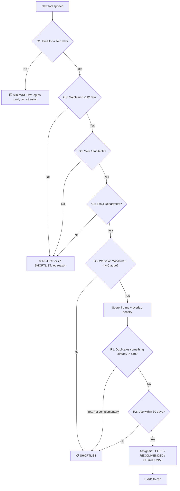

# 🛒 The Admission Protocol — Cart Rules

> This is the constitution of the shopping center. Nothing gets stocked on a shelf
> unless it passes these rules. The default answer for everything is **REJECT**.
> Things earn their way in. This is how we beat "shiny object syndrome."

**Read this first. Every other file in this repo obeys this document.**

---

## 0. The one-sentence philosophy

> **Curated beats comprehensive.** A small set of tools you actually use and trust
> beats a hoard of half-installed novelties that rot, break, leak data, or just sit
> there adding clutter and risk.

A real senior dev does *not* have "hundreds of tools." They have ~15 they trust
deeply and a graveyard of things they tried once and removed. We are building the
~15, on purpose.

---

## 1. The Five Hard Gates (must pass **ALL** of them)

An item is **REJECTED** the moment it fails any single gate. No exceptions, no
"but it's so cool."

| # | Gate | The question | Fail = |
|---|------|--------------|--------|
| **G1** | 💸 **Free** | Is it free forever for a solo dev, with no mandatory recurring charge on top of my Claude sub? A *genuinely usable, non-expiring* free tier counts. | → `SHOWROOM` (logged, not installed) |
| **G2** | 🛠️ **Maintained** | Released/committed in the last ~12 months? Versioned? Not an abandoned one-weekend experiment? | → `REJECT` (or `SHORTLIST` if promising) |
| **G3** | 🛡️ **Safe** | Open-source or trusted vendor? Can I see/understand what data and permissions it touches? No history of malice/sketchy telemetry? | → `REJECT` |
| **G4** | 🎯 **Real job** | Does it solve a concrete need in one of our [Departments](#3-the-departments-aisles)? Or is it just neat? | → `REJECT` (the anti-shiny rule) |
| **G5** | 🪟 **Fits me** | Works on **Windows** + Claude Code (or the Claude surface I use), with reasonable setup and low babysitting? | → `SHORTLIST` |

> **Why these five?** Free protects the wallet. Maintained protects against bit-rot.
> Safe protects the codebase and your data. Real-job kills shiny-object syndrome.
> Fits-me kills tools that look great in a demo but fight your actual machine.

---

## 2. The Scoring Rubric (only for items that passed all 5 gates)

Passing the gates gets you *considered*. Scoring decides your **shelf tier** and
ranks you against rivals doing the same job. Score each 1–5:

| Dimension | 1 (low) | 5 (high) |
|-----------|---------|----------|
| **Value** — how much it actually moves the needle | minor convenience | changes how I work |
| **Maturity** — adoption + stability | brand new / niche | widely used, rock-solid |
| **Setup ease** — friction to get running on Windows | fiddly, manual | one command |
| **Fit** — matches *my* workflow & stack | tangential | bullseye |

Then apply the **Overlap Penalty**: if something already in the cart does this
same job, subtract 3 unless the new tool is *clearly* better or *complementary*
(see Rule R1 below).

**Tier thresholds** (after overlap penalty):

- **🥇 CORE** (16–20) — install first, these are the backbone.
- **🥈 RECOMMENDED** (12–15) — strong; add when the relevant work shows up.
- **🥉 SITUATIONAL** (8–11) — keep on the shelf; install per-project when needed.
- **📋 SHORTLIST** (<8 but interesting) — watch, don't install yet.

---

## 3. The Departments (Aisles)

Every stocked item must belong to at least one. If it fits none, it fails **G4**.

1. 🧱 **Foundations** — the core Claude wiring (MCP, connectors, skills, plugins, hooks, memory).
2. 🪃 **Orchestration** — making Claude plan, delegate, and run multi-step work well.
3. ✅ **Verification** — proving the code actually works.
4. 🔒 **Security** — code safety, secrets, vulnerabilities.
5. ⚡ **Optimization** — performance, cleanliness, bundle/size/speed.
6. 🎨 **UI/UX** — better front-end, components, accessibility.
7. 📊 **Visuals** — diagrams, flowcharts, architecture pictures.
8. 📣 **Creative / Marketing** — posters, copy, brand, social.
9. 📚 **Documentation** — docs systems, READMEs, shared context.
10. 🗃️ **Data / Documents** — databases, files, PDFs/Office, your vault.
11. 🧭 **Planning / Workflow** — idea → demo → prototype → MVP → production.
12. 📌 **Project Mgmt** — status tracking, issues, kanban.
13. ✍️ **Prompting** — prompt generation & enhancement for delegating tasks.
14. 📜 **Compliance** — SOC 2 / ISO 27001 readiness helpers.

---

## 4. The Anti-Shiny-Object Rules (the part that saves you)

These are the rules that stop the cart from bloating. Re-read them whenever you're
tempted.

- **R1 — One job, one tool.** Do not stock two tools that do the same job. Pick the
  best-in-class and remove the rival. (Two tools only coexist if they're genuinely
  *complementary*, not overlapping.)
- **R2 — The 30-day test.** "Will I actually use this within 30 days?" If no →
  `SHORTLIST`, do not install. Wanting to "have it ready" is how clutter happens.
- **R3 — Hype tax.** New + trending ≠ stable. A tool under ~6 months old or with a
  thin track record waits in `SHORTLIST` until it proves it won't be abandoned.
- **R4 — Every install has a cost.** Each MCP server adds context, attack surface,
  another thing to update, and another thing that can break. Budget installs like
  money — because they cost *attention*.
- **R5 — Prefer official & open.** When two options tie, choose the one that is
  official (Anthropic / the vendor itself) and/or open-source and auditable.
- **R6 — Beginner-safe defaults.** Since you're new to MCP/skills, prefer tools with
  clear docs and large communities over powerful-but-obscure ones. You can graduate
  later.

---

## 5. The Verdicts (what the labels mean)

| Label | Meaning | In the cart? |
|-------|---------|--------------|
| 🥇 `CORE` | Backbone. Install on day one. | ✅ Yes |
| 🥈 `RECOMMENDED` | Strong. Add when its job comes up. | ✅ Yes |
| 🥉 `SITUATIONAL` | Useful for specific projects. | ✅ On the shelf |
| 📋 `SHORTLIST` | Promising but unproven/young — watch it. | ⏳ Watchlist |
| 🪟 `SHOWROOM` | Good but **paid** (or not-yet-free). Documented for awareness only. | ❌ Not installed |
| ❌ `REJECTED` | Failed a gate. Logged **with the reason** so we don't reconsider it blindly. | ❌ No |

> We even record **rejections with reasons**. That way, when you see the same shiny
> tool on YouTube in 3 months, you check the list and remember *why* you passed.

---

## 6. Review Cadence (keeping the shop clean)

A shopping center that never restocks or removes expired goods becomes a junkyard.

- **Quarterly re-vet:** Re-run every `CORE`/`RECOMMENDED` item against the 5 gates.
  Did "free" stay free? Is it still maintained?
- **90-day prune:** Anything installed but unused for 90 days → remove it (it can
  always come back; it's documented here).
- **Promotion/Demotion:** A `SHORTLIST` item that matured → promote. A `CORE` tool
  that got flaky/abandoned/paywalled → demote to `SHOWROOM` or `REJECTED`.
- **Log it:** Note the date + decision in [MAINTENANCE.md](./MAINTENANCE.md).

---

## 7. The decision flow (visual)

---

## 8. How to use this protocol in practice

When you (or Claude) find a candidate tool, paste this prompt to Claude Code:

> "Run the AI_CONTEXT Admission Protocol on **\<tool name + link\>**. Walk it through
> the 5 gates, score it, assign a tier and verdict, and tell me whether to add it to
> the cart. If it passes, append a catalog entry to `data.js` and `catalog/catalog.md`
> in the same format as the others, then commit."

That's the whole loop. The protocol does the thinking so you don't impulse-buy.
